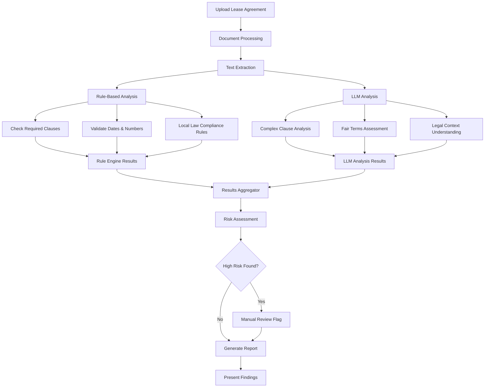

# Problem: 
Need for a software (preferably a webapp) that takes a tenants lease agreement as input and then it would go through it and see if the landlord has complied with the law and has given a fair and legal lease agreement according to the predefined residental tenancies act of the province. 

# Solution 
## We have chosen a Hybrid System

- Combine rule-based checks with LLM analysis
- LLM for complex clause interpretation
- Rules for critical compliance checks
- Backend validation pipeline
- Pro: Balanced approach
Balances accuracy and flexibility
Handles edge cases via LLM
Maintains reliability with rules
Scalable architecture
Can evolve based on needs
- Con: More complex architecture

## Proposed System Flowchart 



## key components:
Key components of this implementation:

### Rule Engine:

Predefined rules for common lease requirements
Pattern matching for required clauses
Date and number validation
Local law compliance checks


### LLM Analysis:

Complex clause interpretation
Fairness assessment
Legal context understanding
Recommendations generation


### Risk Assessment:

Combines rule-based and LLM results
Calculates overall risk level
Flags for manual review when needed


### Frontend:

File upload interface
Real-time analysis feedback
Visual risk indicators
Detailed breakdown of findings


The system is extensible and can be enhanced with:

Additional rule sets
Multiple LLM providers
Document OCR processing
Legal database integration
User feedback loop

# DEV Notes

## to run
Run with uvicorn main:app --reload

you can also use 
```bash
python main.py
```
 to run the server

Access interactive API docs at http://localhost:8000/docs

## Quick Prompt
Project Summary - Lease Agreement Analyzer with Nova Scotia Law Integration
Current Implementation:

FastAPI backend with local Llama 2 70B model integration via Ollama
Two main components:

Law processor for NS Residential Tenancies Act analysis
Rule engine for lease compliance checking

Core Files:

main.py: FastAPI application with lease analysis logic
law_processor.py: Handles law document parsing and requirements
nova_scotia_law.txt: Source law document

Setup Requirements:

Ollama installed and running with llama2:70b model
Python dependencies installed
Law document present in project root

To Complete:
- Test that the model works
- Add specific Nova Scotia lease examples for model training
- Implement remaining rule checks in RuleEngine
- Add test suite for validation
- Add error handling for Ollama API responses
- Optimize prompts with more law-specific context

## The local llama model
- used: ollama pull llama2:70b
By default, Ollama stores models on macOS in: ~/Library/Application Support/ollama/models/

To verify the location and see the model, you can run:
ls -l ~/Library/Application\ Support/ollama/models/

Terminal Output after downloading:
TD3DF:Tenant_Agreement_Analyzer abdulla$ ollama pull llama2:70b
pulling manifest 
pulling 68bbe6dc9cf4... 100% ▕████████████████████████████████████████████████████████▏  38 GB                         
pulling 8c17c2ebb0ea... 100% ▕████████████████████████████████████████████████████████▏ 7.0 KB                         
pulling 7c23fb36d801... 100% ▕████████████████████████████████████████████████████████▏ 4.8 KB                         
pulling 2e0493f67d0c... 100% ▕████████████████████████████████████████████████████████▏   59 B                         
pulling fa304d675061... 100% ▕████████████████████████████████████████████████████████▏   91 B                         
pulling 7c96b46dca6c... 100% ▕████████████████████████████████████████████████████████▏  558 B                         
verifying sha256 digest 
writing manifest 
success 
TD3DF:Tenant_Agreement_Analyzer abdulla$ 

Ollama's Status and list install model can be checked with:
ollama list
